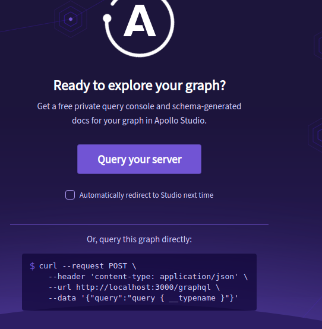
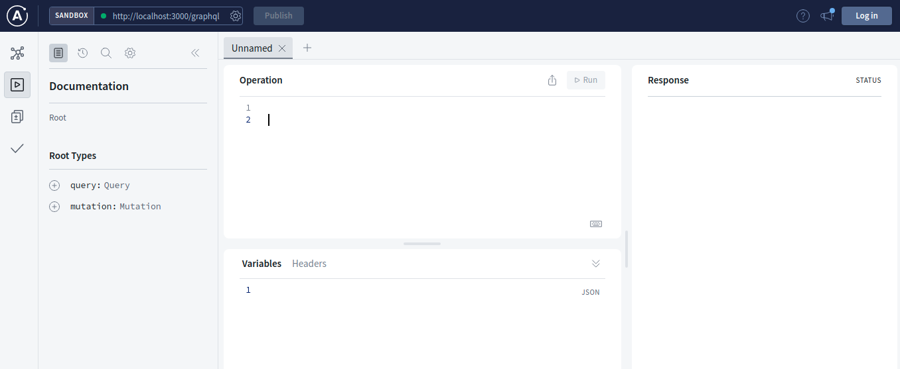
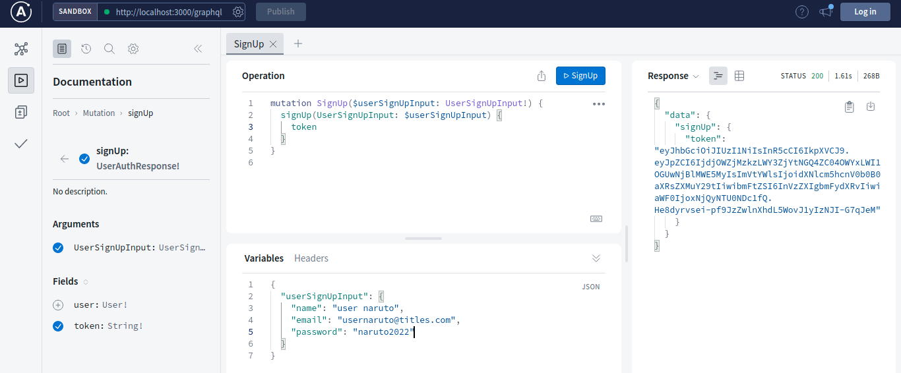
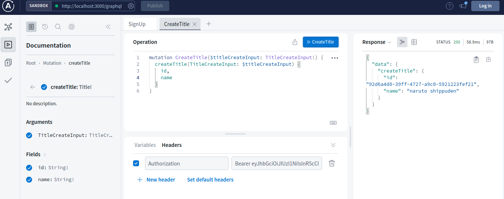

# RXPRO - Desafio Técnico

## Overview
### Descrição do Projeto
Foi criado uma API de **Titles** para desenvoler o projeto com os requisitos solicitados no challenge.\
A API lida com "Titles": títulos que o usuário gosta de assistir (séries, filmes, animes, etc).\
Ao realizar o cadastro e estar autenticado, consegue criar e atualizar os seus títulos!
### Ferramentas
Node: servidor runtime de javascript\
Express: framework para aplicação web\
GraphQL: linguagem de consulta para consumo de API\
Apollo Server: servidor GraphQL\
TypeGraphQL: biblioteca que serve como framework de definição de schemas do GraphQL gerado através de tipagem do Typescript\
TypeORM: ORM para suportar desenvolvimentod e aplicação Node para consultar banco de dados\
Postgres: banco de dados SQL\
JWT: padrão para criação de dados assinadas a fim de criptografar informações utilizados para autenticação\
Jest: framework de escrita e execução de testes automatizados para NodeJS

## Getting Started 
### Pré-requisitos
- NodeJS: versão 8 ou superior instalado no seu ambiente
- Postgres: ter uma instância do banco de dados executando na sua máquina (observar as informações de porta, nome do banco, autenticação para informá-los como variáveis de ambiente da etapa de setup)
### Setup
#### Variáveis de ambiente
- copiar o arquivo `.env.example` e renomear para `.env`
- preencher as variáveis descritas no `.env` de acordo com o seu ambiente de desenvolvimento (máquina, banco de dados, escolher um secret)
#### Instalação e Execução
Entrar no terminal da sua máquina no diretório onde clonou este projeto e realizar seguintes procedimentos:
```bash
# instalar dependências
npm install 

# executar comando de migration do TypeORM
npm run typeorm:cli -- migration:run

# executar aplicação
npm run dev
```

## Interagindo com a aplicação
### Entrando no apollo server studio
Após a terminar o setup e conferir as tabelas do banco de dados a execução da aplicação, acessar a rota `localhost:3000/graphql` para entrar no explorer do landing page do apollo server.



Clique em `Query your server` para ser redirecionado para o apollo graphql studio aonde poderá realizar as queries GraphQL da aplicação



### Autenticação
Na aplicação, tirando a query de `login` e a mutation de `signUp` todas resolvers são protegidas, ou seja, é exigido que o usuário esteja autenticado.\
Para realizar a autenticação, deverá criar um usuário pela mutation de signup ou login e colocar o token retornado para o Header da outra query ou mutation protegida




